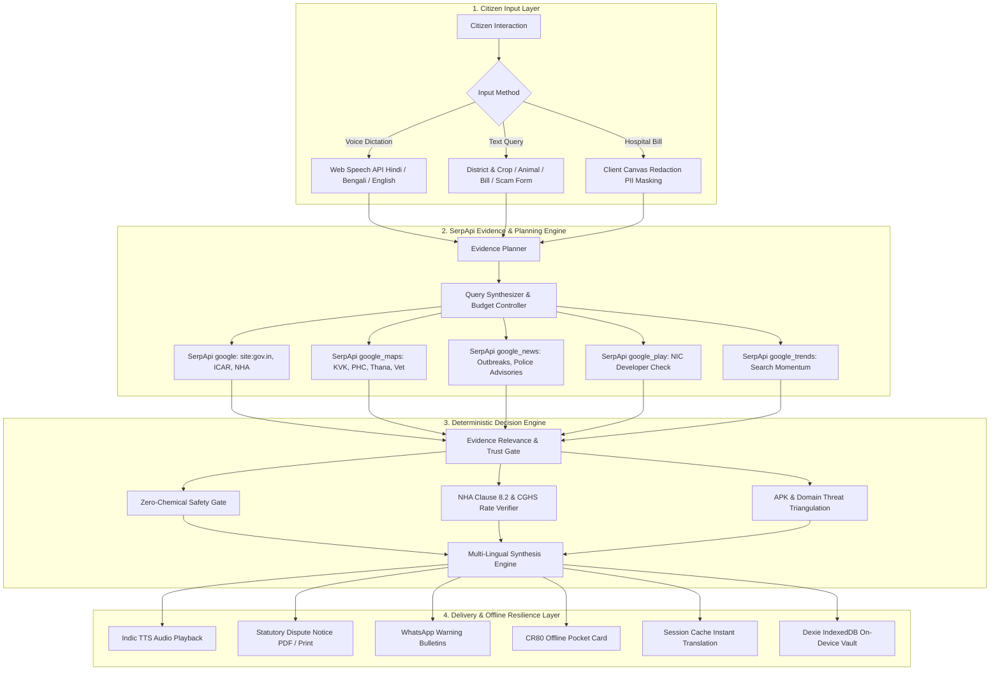

# 🌾 GramRaksha AI (ग्रामरक्षा एआई / গ্রামরक्षा)

<div align="center">

[](https://serpapi.com)
[](https://serpapi.com)
[](https://nextjs.org)
[](https://www.typescriptlang.org)
[](https://vitest.dev)
[](LICENSE)

**100% On-Device, Privacy-First Civic Defense & Real-Time Intelligence Platform Grounded in Verifiable SerpApi Public Web Evidence for Rural India.**

[Project Showcase](#-project-showcase) • [The Problem: A Farmer's Reality](#-the-problem-a-farmers-reality-with-no-one-to-guide-him) • [The Solution: Grounded Truth](#-the-solution-spoon-fed-truth-powered-by-serpapi) • [Core Features](#-exhaustive-feature-deep-dive) • [SerpApi Engines](#-material-serpapi-integration--engine-breakdown) • [Hidden Capabilities](#-hidden-capabilities--offline-resilience) • [System Workflow](#-project-workflow--system-architecture) • [Setup Instructions](#-startup--setup-instructions) • [Judge Demo Mode](#-judge-demo-mode--live-telemetry)

</div>

---

## 📸 Project Showcase

<div align="center">
  
</div>

<br />

<div align="center">
  <table width="100%">
    <tr>
      <td width="50%" align="center">
        
        <br />
        <b>Sovereign Rural Intelligence Hub (Hindi / Bengali / English)</b>
      </td>
      <td width="50%" align="center">
        
        <br />
        <b>6-Pillar Core Emergency & Civic Defense Modules</b>
      </td>
    </tr>
    <tr>
      <td width="50%" align="center">
        
        <br />
        <b>KrishiSahay: ICAR Step-by-Step Triage & Live Mandi APMC Intel</b>
      </td>
      <td width="50%" align="center">
        
        <br />
        <b>PashuSahay: Livestock First-Aid, 1962 MVU Dial & Audio Triage</b>
      </td>
    </tr>
    <tr>
      <td colspan="2" align="center">
        
        <br />
        <b>MediShield: 100% On-Device Canvas Redaction & NHA Clause 8.2 Dispute Generator</b>
      </td>
    </tr>
  </table>
</div>

---

## 🚨 The Problem: A Farmer's Reality With No One to Guide Him

### Standing in the Field Alone: The Human Reality of 700 Million Citizens

Imagine Ramu, a smallholder farmer in a distant village in Madhya Pradesh or Bengal. He never studied past primary school. He cannot read complicated English legal documents, official government gazettes, or scientific research papers. His entire family's survival for the next twelve months depends entirely on a 1.5-acre plot of land and two milch cows.

He carries an inexpensive Android smartphone with a cracked screen—a device he primarily uses for phone calls and occasional family photos. He has never navigated a complex government portal, and search engine results return commercial ads and English blogs that make no sense to him.

**When a crisis hits, he is completely alone:**
- There is no agricultural scientist living in his village.
- The nearest government veterinary clinic is 25 kilometers away over broken rural roads, and he doesn't even know its phone number or operating hours.
- When an emergency strikes, he has **no one to guide him**, no one to verify facts, and no one in his corner. 

He lives in constant fear that a single bad decision will push his family into irreversible debt.

---

### Six Critical Moments When a Farmer is Completely Helpless

#### 1. The Agrochemical Trap: Yellowing Crops & Predatory Shopkeepers
One morning at dawn, Ramu walks out into his field and sees his standing paddy crop covered in brown spots and curling yellow leaves. His chest tightens in panic. Having sunk his family's annual savings and an informal high-interest loan into these seeds and fertilizers, he rushes to the nearest pesticide retail shop in the mandi town.

The private pesticide dealer immediately senses his desperation and illiteracy. Instead of recommending a simple organic treatment or alerting him to a fungal blast, the dealer pushes ₹3,500 worth of unverified, expensive, or banned synthetic chemicals, claiming: *"Spray this twice a day or your whole field will die."* Ramu borrows more cash from a local moneylender at 40% interest just to buy that bottle. The chemical poisons his soil, kills beneficial pollinators, fails to cure the disease, and plunges his family deeper into debt.

#### 2. The Livestock Heartbreak: Sick Cattle, No Doctor, and Lost Savings
To a rural family, a cow or a buffalo is not just an animal—it is their liquid bank account and daily milk sustenance. When a cow develops sudden high fever, weeping eye discharge, or painful nodules on its skin (such as Lumpy Skin Disease), the farmer does not know what quarantine means. He does not know how to clean the lesions or how to keep the other animals safe.

Because he has no simple first-aid instructions, he tries local folk remedies—applying caustic ash or engine oil to wounds—which only worsens the infection. By the time a mobile veterinary clinic can be contacted, the animal has succumbed to secondary infections. In a single day, an entire household's economic backbone is wiped out.

#### 3. The Hospital Extortion: Illegal Cash Demands Despite Ayushman Cards
When Ramu's daughter falls severely ill with pneumonia or needs an emergency appendectomy, he rushes her to an empanelled private nursing home in the district town. He proudly holds up his **Ayushman Bharat (PM-JAY)** golden card—the card the Prime Minister promised would ensure cashless medical treatment up to ₹5,00,000.

The hospital billing clerk looks at him and says coldly: *"The Ayushman portal server is down. You must deposit ₹25,000 cash right now before the doctor will touch the patient."* Ramu does not know the law. He does not know that **National Health Authority (NHA) Clause 8.2 strictly prohibits hospitals from demanding advance cash from PM-JAY beneficiaries**. Terrified that his daughter might die in the waiting room, he rushes out in tears, sells his wife's silver jewellery, or signs away a piece of land to an extortionate moneylender to pay an illegal bribe.

#### 4. The 72-Hour Clock: Lost Insurance After Natural Disasters
When unseasonal hailstorms or flash floods flatten his harvest three days before cutting, Ramu sits by the roadside in despair. What he does not know is that the **Pradhan Mantri Fasal Bima Yojana (PMFBY)** has a strict statutory rule: **the farmer must intimate crop loss within exactly 72 hours** with evidence to be eligible for individual calamity compensation.

Ramu waits a week, hoping the village Patwari or an insurance agent will come by to inspect the damage. By the time someone arrives, the 72-hour window has expired. The insurance company summarily rejects his claim on procedural grounds. He receives ₹0 in compensation, despite having paid insurance premiums through his Kisan Credit Card (KCC) account.

#### 5. The Cyber Ambush: Fake Welfare APKs Wiping Out Bank Accounts
Ramu receives a forwarded WhatsApp message from a neighbor: *"Urgent: PM-Kisan 18th installment of ₹4,000 released! Click here to update your bank KYC."* Below the message is an Android installer link: `pmkisan_kyc_update.apk`.

Because he desperately needs money to buy seed for the next season, he taps the link and installs the application. The sideloaded app is a trojan that grants background SMS permissions. Within minutes, cybercriminals intercept his bank OTPs and drain the remaining ₹6,800 sitting in his Direct Benefit Transfer (DBT) account. He does not know how to file an online cyber complaint, and by the time he reaches the police station, the money is gone forever.

#### 6. The Blackout: Zero Connectivity When Emergencies Strike
In remote hamlets with frequent power cuts and erratic 2G mobile signals, emergencies rarely happen when Google is accessible. If a venomous snake bites a child at 10 PM or a family needs urgent police intervention, villagers scramble in darkness without a single verified phone number for the jurisdictional Police Thana, the 24x7 Primary Health Centre (PHC), or the local ambulance desk.

---

## 💡 The Solution: Spoon-Fed Truth Powered by SerpApi

**GramRaksha AI** was built to be the tireless, incorruptible protector for every rural citizen who has no one else to guide them. It transforms the overwhelming, bureaucratic web into **literal, step-by-step guidance in the farmer's native mother tongue, written and spoken in such simple language that even a 10-year-old child can understand and act upon it.**

```
┌────────────────────────────────────────────────────────────────────────────────────────┐
│                                  GRAMRAKSHA AI                                         │
│                       SOVEREIGN RURAL CIVIC DEFENSE PLATFORM                           │
└───────────────────────────────────────────┬────────────────────────────────────────────┘
                                            │
               ┌────────────────────────────┴───────────────────────────┐
               ▼                                                        ▼
┌─────────────────────────────┐                         ┌────────────────────────────────┐
│   CITIZEN CRISIS INPUT      │                         │     SERPAPI INTELLIGENCE       │
│  • Voice Dictation (3 Lang) │                         │  • google (Regulatory/Statute) │
│  • Dialect Query Processing │ ──── Query Planner ───► │  • google_maps (Local Infra)   │
│  • On-Device Image Redactor │                         │  • google_news (30d Ground)    │
│  • Zero-PII Canvas Privacy  │                         │  • google_play (Official Dev)  │
└─────────────────────────────┘                         │  • google_trends (Momentum)    │
                                                        └───────────────┬────────────────┘
                                                                        │
                                                                        ▼
┌─────────────────────────────┐                         ┌────────────────────────────────┐
│   ON-DEVICE CIVIC ACTION    │                         │    DETERMINISTIC VERIFICATION  │
│  • Statutory Dispute Notice │                         │  • Strict ICAR Relevance Gate  │
│  • 1-Tap 1962/1930/14447    │ ◄─── Action Engine ───  │  • NHA Clause 8.2 Cashless     │
│  • Offline CR80 Pocket Card │                         │  • Arithmetic Bill Audit       │
│  • IndexedDB Offline Vault  │                         │  • Zero-Chemical Safety Filter │
└─────────────────────────────┘                         └────────────────────────────────┘
```

---

### What GramRaksha AI Does: A Patient, Protective Companion in His Mother Tongue

1. **He Doesn't Need to Type a Single Word (Voice In, Voice Out):**
   The farmer simply taps the large microphone button on his screen and talks naturally in his mother tongue (Hindi, Bengali, or English):  
   > *"Bhaiya, hamare khet mein dhan ki pattiya peeli pad rahi hain aur kaale daag hain, hum kya karein?"*  
   > *(Brother, my paddy leaves are turning yellow with black spots, what should I do?)*  
   
   The application listens, understands his regional context, and uses native Indic Text-to-Speech to **speak back to him** in clear, comforting language.

2. **Literal, Spoon-Fed Steps — So Simple Even a Child Can Follow:**
   Instead of dumping a 50-page scientific PDF or technical agronomic jargon, GramRaksha AI gives him a 3-step action card:
   - **Step 1 (Do This Right Now Today):** *"Remove the infected leaves and bury them outside the field so the wind doesn't spread it. Spray a mixture of 10% cow urine diluted in water on the affected patch."*
   - **Step 2 (What NEVER to Do):** *"Do NOT buy chemical sprays or toxic powders from the shop right now. It will burn your young crop and waste your hard-earned money."*
   - **Step 3 (Who to Call for Help):** *"Here is the direct phone number of the Krishi Vigyan Kendra scientist located in your district. Tap the green button to call them right now for free."*

3. **An Incorruptible Shield Against Hospital Harassment:**
   When a hospital demands an illegal cash deposit for an Ayushman patient, the farmer taps **MediShield**. The app automatically generates a formal, statutory **Medical Superintendent Dispute Notice** citing NHA Clause 8.2, complete with patient details and legal penalty references. He can print it or hand his phone directly to the hospital administrative desk. Confronted with formal statutory language, hospital administrators routinely waive the illegal cash demand immediately.

4. **1-Tap Lifelines for Every Real Crisis:**
   Every single screen prominently features verified emergency call buttons:
   - **1962** — Mobile Veterinary Clinic Ambulance for sick cattle.
   - **14447** — Kisan Bima Crop Insurance loss intimation hotline.
   - **14555** — National Ayushman Bharat Grievance Cell.
   - **1930** — National Cybercrime Helpline to freeze stolen bank funds within the golden hour.
   - **112 / 108** — National Police and Medical Emergency services.

---

### Why SerpApi is the Unshakeable Backbone of GramRaksha AI

Generic AI models hallucinate: they make up non-existent government circulars, give wrong phone numbers, and can invent dangerous chemical cocktails that ruin soil health.

**GramRaksha AI uses SerpApi to ensure every single recommendation is anchored in real-world truth:**
- **Authoritative Government Evidence:** Uses SerpApi's `google` engine with precision site scoping (`site:icar.gov.in`, `site:pmjay.gov.in`, `site:pmfby.gov.in`, `site:sancharsaathi.gov.in`) so the farmer only receives advice from official research bodies like the Indian Council of Agricultural Research (ICAR) and National Dairy Development Board (NDDB).
- **Physical Ground Truth via Google Maps:** Uses SerpApi's `google_maps` engine to pinpoint the exact name, address, distance, and direct phone number of the nearest Krishi Vigyan Kendra, Government Veterinary Dispensary, or Primary Health Centre in the farmer's district.
- **Breaking News & Calamity Alerts:** Uses SerpApi's `google_news` engine to cross-reference district-level weather disaster notifications and police cybercrime advisories from the last 30 to 90 days.
- **Rogue APK Unmasking:** Uses SerpApi's `google_play` engine to instantly check if an app circulating on WhatsApp was genuinely published by the National Informatics Centre (NIC) or is an unverified malware apk designed to steal bank balances.
- **Market Price Intelligence:** Leverages SerpApi to surface authentic APMC mandi commodity prices (`agmarknet.gov.in`) and Google Trends search momentum, empowering farmers to negotiate fair rates with middlemen.

---

## 🛠️ Exhaustive Feature Deep Dive

### 🌾 1. KrishiSahay (Crop Protection & Mandi Intel)
* **Coverage Across All 35 States & UTs:** Localized agronomic advisories calibrated across 720+ Indian districts.
* **4-Tab Actionable Advisory Stepper:**
  1. **Action Plan:** Spoon-fed cultural practices, irrigation management, sanitation, and biological controls derived from ICAR guidelines.
  2. **Mandi Rates:** Real-time APMC Mandi price cards (modal rate, minimum rate, maximum rate per quintal) with Google Trends regional interest momentum.
  3. **Verified Sources:** Transparent citation trail displaying snippet text, domain authorities (`agmarknet.gov.in`, `icar.org.in`), and exact crawl timestamps.
  4. **KVKs & Expert Escalation:** Local Krishi Vigyan Kendra contact numbers, Kisan Call Centre hotline (**1551**), and official educational video advisories.
* **Low-Literacy First:** One-tap voice dictation input (Hindi, Bengali, English) and Indic Text-to-Speech audio readout for illiterate and semi-literate farmers.
* **Zero Chemical Dosage Engine:** Refuses to generate synthetic chemical dosages; enforces organic practices and routes complex pathology directly to local KVK scientists.

### 🐄 2. PashuSahay (Livestock & Veterinary Care)
* **Species-Specific Guidance:** Tailored triage for Cattle, Buffaloes, Goats, Sheep, and Poultry.
* **Spoon-Fed First-Aid Steps:** Plain-language, step-by-step guidance on quarantine isolation, hydration, wound management, and nutrition.
* **What NEVER To Do (Safety Warnings):** Highlights dangerous local folk remedies, improper medication administration, and toxic fodder practices.
* **Physical Infrastructure Discovery:** Queries **SerpApi Google Maps** to surface nearest operational Government Veterinary Hospitals and dispensaries.
* **Emergency Lifeline Integration:** 1-tap call button for the **1962 Mobile Veterinary Unit (MVU)** ambulance service and NDDB helplines.
* **Indic Audio Readout:** Full voice playback of instructions in the farmer's native tongue.

### 🏥 3. MediShield & Ayushman Cashless Shield
* **Deterministic Arithmetic Bill Audit:** Audits hospital bills line-by-line, verifying if individual charges tally with the claimed total, and flagging arbitrary "miscellaneous", "nursing administration", or "bio-waste" surcharges.
* **Ayushman Cashless Shield (NHA Clause 8.2):** Validates hospital empanelment under PM-JAY and benchmarks billed amounts against CGHS/State health rate ceilings. Enforces NHA statutory regulations strictly prohibiting advance cash deposits for golden card holders.
* **Formal Statutory Dispute Notice Generator:** Generates a formal legal notice addressed to the Hospital Medical Superintendent and District Grievance Officer, citing relevant NHA circulars, patient details, and refund/waiver demands. Printable as an A4 document or exportable to WhatsApp.
* **4-Tier Escalation Ladder:** Provides a time-bound procedural roadmap:
  - *Day 0:* Hospital PMAM Desk & Grievance Cell
  - *Day 7:* State Health Agency (SHA) & National Helpline (**14555**)
  - *Day 15:* e-Daakhil Consumer Protection Forum (under Consumer Protection Act 2019)
  - *Day 30:* District Legal Services Authority (DLSA) for free legal aid.

### 🛡️ 4. Suraksha Check (Scam & Rogue APK Defense)
* **Multi-Engine Threat Triangulation:** Detects fraudulent welfare scheme announcements, malicious APK downloads, fake upfront fee demands, and power cutoff threats.
* **Google Play Developer Verification:** Uses SerpApi's `google_play` engine to inspect whether an advertised app is published by the verified National Informatics Centre (NIC) or is an unverified sideloaded malware APK.
* **Official Redressal Integration:** Direct links to report fraudulent numbers and URLs via **Chakshu (Sanchar Saathi)** and 1-tap dialer for the **1930 National Cybercrime Helpline**.
* **Village Warning Bulletins:** Generates printable and shareable alert notices for village WhatsApp groups and Panchayat notice boards.

### ⏱️ 5. Fasal 72h (PMFBY 72-Hour Loss Intimation Kit)
* **Strict Statutory 72-Hour Loss Intimation:** Guides farmers through submitting post-harvest and localized calamity crop loss reports within the mandatory 72-hour PMFBY window.
* **Dynamic Countdown Timer:** Real-time countdown tracking remaining hours before statutory claim forfeiture.
* **Geotagged Photo Evidence Logger:** Watermarks farm damage photos with timestamp, latitude, longitude, and farmer identity.
* **Formal Claim Dossier Generator:** Prepares a structured loss intimation packet ready for submission to the District Agriculture Officer (DAO) and empanelled insurance company.
* **Direct Intimation Channels:** Links to the Kisan Bima toll-free hotline (**14447**) and the national PMFBY portal.

### 🪪 6. Pocket Card (Offline Village Emergency Directory)
* **CR80 Wallet-Sized Layout:** Formats essential village emergency contacts into a printable pocket card.
* **Local Directory Population:** Discovers and formats local Police Thana, Primary Health Centre (PHC), Krishi Vigyan Kendra (KVK), and District Legal Services Authority (DLSA) contacts.
* **vCard (.vcf) Export:** One-tap download of all verified contacts into the farmer's mobile address book.
* **Zero Connectivity Resilience:** Works 100% offline via browser IndexedDB cache.

---

## 🔍 Material SerpApi Integration & Engine Breakdown

GramRaksha AI leverages **five distinct SerpApi search engines**. SerpApi is not an optional bolt-on; it is the factual foundation of every feature.

### SerpApi Engine Architecture Matrix

| SerpApi Engine (`engine`) | Specific Module | Query Blueprint & Targeted Filters | Information Retrieved & Applied |
| :--- | :--- | :--- | :--- |
| **`google`** | **KrishiSahay** | `site:icar.gov.in OR site:*.gov.in OR site:*.ac.in {crop} {district} package of practices OR advisory`<br>`gl=in`, `hl=hi/bn/en` | Official agronomic package-of-practices, non-chemical pest management, university advisories. |
| **`google`** | **MediShield** | `site:pmjay.gov.in OR site:nha.gov.in {hospital_name} empanelled packages "Clause 8.2" cashless`<br>`gl=in`, `hl=en` | Validates hospital PM-JAY empanelment status, NHA statutory cashless guidelines, and CGHS price ceilings. |
| **`google`** | **Fasal 72h** | `site:pmfby.gov.in {state} {district} cluster insurance company nodal officer toll free loss intimation`<br>`gl=in`, `hl=en` | Cluster-allocated insurance company, official 72h loss intimation portal, and district agriculture office contacts. |
| **`google`** | **PashuSahay** | `site:ivri.nic.in OR site:dahd.nic.in OR site:nddb.coop {species} {symptom} treatment advisory first aid`<br>`gl=in`, `hl=en` | Official ICAR-IVRI veterinary clinical guidelines, quarantine protocols, and NDDB dairy animal care standards. |
| **`google`** | **Suraksha Check** | `site:gov.in OR site:sancharsaathi.gov.in {scheme_name} official portal application form`<br>`gl=in`, `hl=en` | Authentic government welfare domain validation (unmasks lookalike phishing domains). |
| **`google_maps`** | **KrishiSahay** | `q=Krishi Vigyan Kendra KVK {district}`<br>`type=search`, `gl=in` | Local KVK office address, pin code, GPS coordinates, scientist landline/mobile numbers. |
| **`google_maps`** | **PashuSahay** | `q=government veterinary hospital OR veterinary dispensary near {district}`<br>`type=search`, `gl=in` | Nearest operational government veterinary clinic, emergency operating hours, and road directions. |
| **`google_maps`** | **Pocket Card** | `q=Police Station Thana OR Primary Health Centre PHC {block} {district}`<br>`type=search`, `gl=in` | Jurisdictional Thana, round-the-clock PHC/CHC emergency desks, and local administrative offices. |
| **`google_maps`** | **MediShield** | `q=Pradhan Mantri Arogya Mitra PMAM desk {hospital} {city}`<br>`type=search`, `gl=in` | Hospital physical verification, location coordinates, and on-site Ayushman kiosk presence. |
| **`google_news`** | **KrishiSahay** | `q={crop} disease outbreak alert {state} {district}`<br>`tbm=nws`, `gl=in`, `when:30d` | District pest flare-ups, yellow rust/fall armyworm warnings, and unseasonal weather damage bulletins. |
| **`google_news`** | **Suraksha Check** | `q={scheme_name} scam OR fake APK OR fraud arrest advisory {state} police`<br>`tbm=nws`, `gl=in`, `when:90d` | State Police Cyber Crime Cell warnings, unmasked fraudulent APK campaigns, and FIR advisories. |
| **`google_news`** | **Fasal 72h** | `q={district} crop damage unseasonal rain hailstorm compensation notification`<br>`tbm=nws`, `gl=in`, `when:30d` | Official state disaster management notifications and declared calamity zones for insurance claims. |
| **`google_play`** | **Suraksha Check** | `q={app_name} OR {package_name}`<br>`gl=in`, `hl=en` | Verifies whether the requested APK exists in the Google Play Store, developer publisher (`National Informatics Centre`), and app authenticity. |
| **`google_trends`** | **KrishiSahay** | `q={crop} disease`<br>`geo=IN`, `date=today 1-m` | Search volume momentum indicating widespread pest or crop blight spreading across adjacent districts. |

---

## 🔒 Hidden Capabilities & Offline Resilience

### ⚡ 1. Zero-Latency Multi-Language State Persistence (`sessionStorage`)
When a rural citizen switches language (e.g., from English to Hindi or Bengali), standard web applications reload the route, wiping out user input and requiring duplicate API calls. 
* GramRaksha AI implements a non-destructive active session cache (`gramraksha:active_*_session`).
* Switching languages instantly (<1ms) translates and re-renders the complete report in place without making duplicate SerpApi calls or resetting user forms.

### 💾 2. 100% On-Device IndexedDB Persistence (Dexie.js)
Rural citizens are vulnerable to data profiling. GramRaksha AI operates under a **zero-cloud-telemetry policy**:
* All crop briefs, veterinary questions, bill audits, dispute notices, and pocket cards are stored in the user's browser IndexedDB via Dexie.js.
* No personal data or medical records are ever sent to central application servers.
* A single tap on the `/dashboard` route securely purges all stored records.

### 🛡️ 3. Client-Side HTML5 Canvas PII Redaction
Before a medical bill or document image is processed, the citizen can review the file locally. All sensitive personal details (patient name, phone number, address) can be masked in the browser using HTML5 Canvas before any data extraction.

### 🎙️ 4. Native Indic Web Speech API Audio Engine
Designed for low-literacy users:
* Native browser speech recognition captures farmer concerns in regional dialects.
* Indic Text-to-Speech reads out step-by-step triage instructions in Hindi, Bengali, or English with pause/resume controls.

---

## 🏗️ Project Workflow & System Architecture



---

## 🚀 Startup & Setup Instructions

### Prerequisites
* **Node.js 20 LTS** or higher installed ([Download Node.js](https://nodejs.org/))
* **Git** installed ([Download Git](https://git-scm.com/))
* A **SerpApi API Key** (obtain free at [serpapi.com](https://serpapi.com))

### 1. Clone the Repository
```bash
git clone https://github.com/Manthan-cpp/GramRaksha-AI.git
cd GramRaksha-AI
```

### 2. Install Dependencies
```bash
npm install
```

### 3. Configure Environment Variables
Create a `.env` file in the project root:
```bash
cp .env.example .env
```
Open `.env` and enter your SerpApi credentials:
```env
# SerpApi Credentials (https://serpapi.com)
SERPAPI_API_KEY=your_actual_serpapi_key_here

# SerpApi Configuration & Budget Controls
SERPAPI_MONTHLY_CAP=250
SERPAPI_CACHE_DIR=.cache/serpapi
SERPAPI_TIMEOUT_MS=30000
QUERY_BUDGET_PER_CASE=7

# Evidence Mode: "live" (calls SerpApi live) or "recorded" (offline fallback)
EVIDENCE_MODE=live

# Demo Judge Panel (0 to hide, 1 to show)
NEXT_PUBLIC_DEMO=0
```

### 4. Run the Development Server
```bash
npm run dev
```
Open [http://localhost:3000](http://localhost:3000) in your web browser.

### 5. Build for Production
To create an optimized production build:
```bash
npm run build
npm start
```

---

## 🧪 Verification & Quality Gates

GramRaksha AI adheres to strict software engineering standards with zero TypeScript errors and a comprehensive automated test suite:

```bash
# Run the complete test suite (152 unit and integration tests)
npm test

# Verify strict TypeScript compilation with zero errors
npm run typecheck

# Audit code formatting and linting
npm run lint

# Compile Next.js 16.3 production Turbopack build
npm run build
```

### Test Suite Summary
* **152 passing automated tests** across 19 test suites in Vitest.
* Covers: evidence planning, query budgeting, NHA Clause 8.2 compliance, bill arithmetic reconciliation, APK pattern matching, safe chemical filtering, Dexie storage, and vCard formatting.

---

## 🧑‍⚖️ Judge Demo Mode & Live Telemetry

To assist hackathon judges and evaluators in inspecting the underlying SerpApi calls in real time:

1. Add **`?demo=1`** to any URL in your browser:
   ```
   http://localhost:3000/en/home?demo=1
   http://localhost:3000/en/krishi?demo=1
   http://localhost:3000/en/medi?demo=1
   http://localhost:3000/en/pashu?demo=1
   http://localhost:3000/en/suraksha?demo=1
   http://localhost:3000/en/card?demo=1
   ```
2. A floating **Judge Telemetry Panel** appears on the bottom right:
   * **Live SerpApi Latency:** Real-time millisecond execution timings for each search engine.
   * **Engine Inspector:** Displays the exact SerpApi engine (`google`, `google_maps`, `google_news`, `google_play`, `google_trends`) called.
   * **Raw Query & Parameters:** Shows the exact query string, location biasing, and language headers sent to SerpApi.
   * **Kept Evidence vs Filtered:** Demonstrates the deterministic relevance filter in action.
   * **Live / Recorded Switcher:** Allows toggling between live SerpApi calls and recorded offline fixtures.

---

## 🛡️ Safety & Grounding Principles

1. **Zero Chemical Prescriptions:** The system never prescribes synthetic chemical dosages; it spoon-feeds organic cultural practices and directs users to certified KVK scientists.
2. **No Hallucinated Verdicts:** In scam and bill audits, language strictly mirrors official public notices and consumer protection statutes without defamatory accusations.
3. **Emergency Lifelines Front and Center:** Direct telephone hotlines for **112** (National Emergency), **108** (Ambulance), **1962** (Veterinary), **14447** (Crop Insurance), **14555** (Ayushman), and **1930** (Cybercrime) are accessible from every page.
4. **Verifiable Citations:** Every summary statement cites verbatim text from an official kept web source.

---

## 📄 License & Acknowledgments

GramRaksha AI is licensed under the [MIT License](LICENSE).

Developed for the **SerpApi India Hackathon 2026** under the **Knowledge & Public Interest** track. Special thanks to the **SerpApi team** for providing the high-speed search APIs that power real-time rural intelligence.
