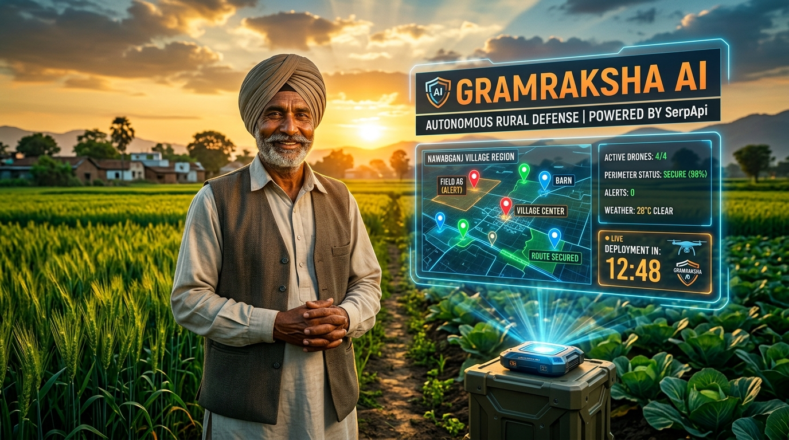
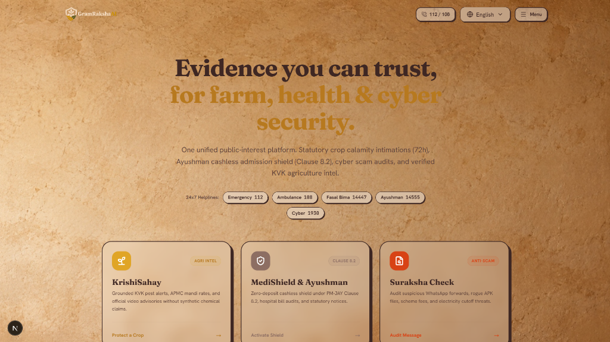
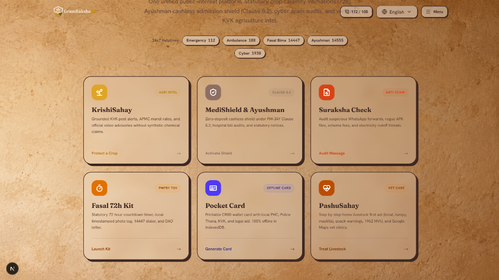
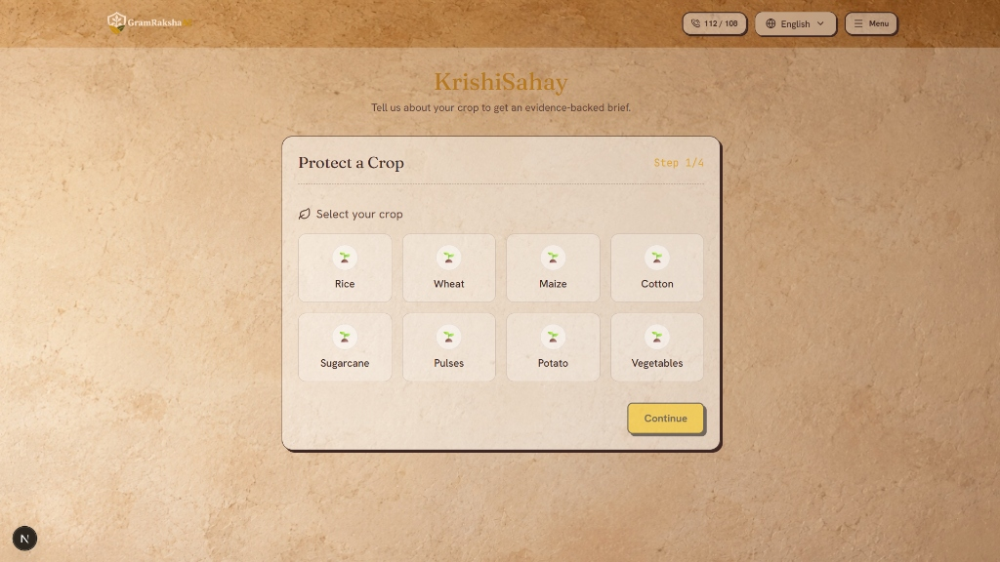
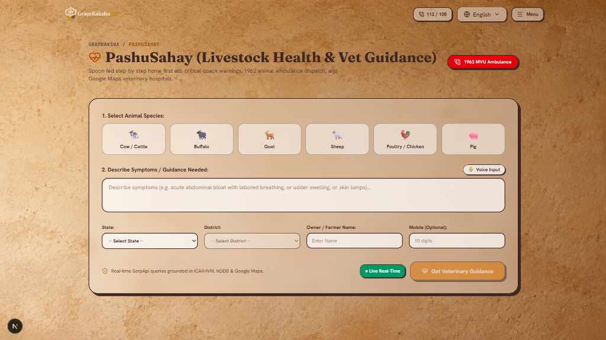
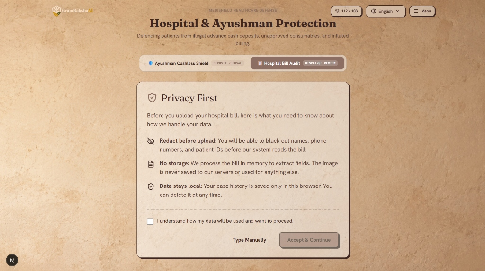
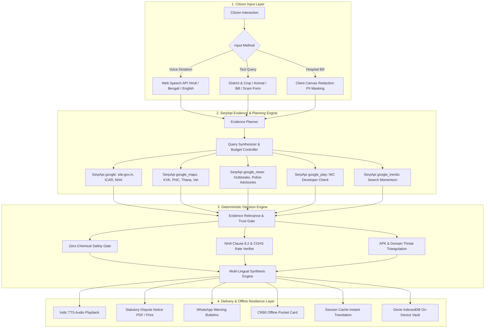

# 🌾 GramRaksha AI (ग्रामरक्षा एआई / গ্রামরक्षा)

<div align="center">

[](https://serpapi.com)
[](https://serpapi.com)
[](https://nextjs.org)
[](https://www.typescriptlang.org)
[](https://vitest.dev)
[](LICENSE)

**100% On-Device, Privacy-First Civic Defense & Real-Time Intelligence Platform Grounded in Verifiable SerpApi Public Web Evidence for Rural India.**

[Live Telemetry Demo](#-judge-demo-mode--live-telemetry) • [Problem Statement](#-1-problem-statement) • [Solution & SerpApi](#-2-the-solution-powered-by-serpapi) • [Screenshot Gallery](#-3-project-showcase--visual-tour) • [Feature Deep Dive](#-4-exhaustive-feature-deep-dive) • [SerpApi Engines](#-5-material-serpapi-integration--engine-breakdown) • [System Workflow](#-6-project-workflow--system-architecture) • [Setup Instructions](#-7-startup--setup-instructions)

</div>

---

## 📸 Project Showcase

<div align="center">
  
</div>

<br />

<div align="center">
  <table width="100%">
    <tr>
      <td width="50%" align="center">
        
        <br />
        <b>Sovereign Rural Intelligence Hub (Hindi / Bengali / English)</b>
      </td>
      <td width="50%" align="center">
        
        <br />
        <b>6-Pillar Core Emergency & Civic Defense Modules</b>
      </td>
    </tr>
    <tr>
      <td width="50%" align="center">
        
        <br />
        <b>KrishiSahay: ICAR Step-by-Step Triage & Live Mandi APMC Intel</b>
      </td>
      <td width="50%" align="center">
        
        <br />
        <b>PashuSahay: Livestock First-Aid, 1962 MVU Dial & Audio Triage</b>
      </td>
    </tr>
    <tr>
      <td colspan="2" align="center">
        
        <br />
        <b>MediShield: 100% On-Device Canvas Redaction & NHA Clause 8.2 Dispute Generator</b>
      </td>
    </tr>
  </table>
</div>

---

## 🚨 1. Problem Statement

Over **700 million citizens across 600,000+ villages in rural India** live with high financial vulnerability during unforeseen agricultural, medical, and cyber crises. When rural households experience emergencies, the lack of immediate, authenticated public information causes severe economic exploitation and irreversible distress.

### The Six Acute Rural Crisis Scenarios

1. **Agrochemical Exploitation & Crop Diseases:**
   When crops exhibit sudden yellowing, fungal blast, or pest infestations, smallholder farmers often seek advice from local commission agents and unregulated pesticide retail shops. Farmers are frequently misdirected into purchasing spurious synthetic chemicals and toxic pesticides without agronomic backing, destroying soil microbiomes and trapping families in debt cycles.

2. **Livestock Epidemics & Veterinary Deprivation:**
   Livestock represents the liquid wealth and insurance policy of smallholder households. When cattle or goats contract contagious diseases (such as Lumpy Skin Disease, Foot & Mouth Disease, or Mastitis), farmers lack immediate plain-language triage and quarantine protocols. Due to delayed veterinary intervention, treatable conditions lead to animal mortality, wiping out milk revenue and household savings.

3. **Medical Overcharging & Illegal Hospital Advance Cash Demands:**
   Even when rural families carry valid **Ayushman Bharat Pradhan Mantri Jan Arogya Yojana (PM-JAY)** golden cards, empanelled private hospitals frequently violate National Health Authority (NHA) regulations by demanding illegal upfront cash deposits (₹10,000 to ₹50,000) before admission or withholding discharge over inflated, unitemised "miscellaneous charges" and consumable surcharges. Families who are legally entitled to cashless treatment borrow from local moneylenders at 36% to 60% annual interest.

4. **Strict 72-Hour PMFBY Crop Insurance Loss Intimation Deadlines:**
   Following localized natural disasters (unseasonal hailstorms, flash floods, cloudbursts, post-harvest cyclone damage), the **Pradhan Mantri Fasal Bima Yojana (PMFBY)** mandates that farmers report crop loss within a strict **72-hour statutory window**. Lacking structured documentation, time-stamped photo evidence, and nodal insurer contacts, hundreds of thousands of legitimate insurance claims are summarily rejected each harvest season.

5. **Welfare Scheme Cyber Fraud & Malicious WhatsApp APKs:**
   Rural citizens are aggressively targeted with social-engineering fraud: fraudulent WhatsApp messages claiming urgent PM-Kisan 17th/18th installment release, fake subsidised solar pump links, and malicious Android application package files (e.g., `pmkisan_update.apk`). When installed, these sideloaded apps intercept banking OTPs and siphon savings from Direct Benefit Transfer (DBT) bank accounts.

6. **Severe Village Connectivity Blind Spots & Information Asymmetry:**
   When emergencies happen in remote rural belts with spotty or zero cellular connectivity, villagers do not possess contact numbers for their local jurisdictional Police Thana, Primary Health Centre (PHC), Krishi Vigyan Kendra (KVK), or District Legal Services Authority (DLSA). Generic search engines provide ad-cluttered results that are unnavigable for first-time smartphone users.

---

## 💡 2. The Solution: Powered by SerpApi

**GramRaksha AI** is an open-source, on-device, sovereign civic defense platform that solves this fundamental information asymmetry by grounding every single recommendation, audit, and legal notice in **live, verified public web evidence retrieved via SerpApi**.

```
┌────────────────────────────────────────────────────────────────────────────────────────┐
│                                  GRAMRAKSHA AI                                         │
│                       SOVEREIGN RURAL CIVIC DEFENSE PLATFORM                           │
└───────────────────────────────────────────┬────────────────────────────────────────────┘
                                            │
               ┌────────────────────────────┴───────────────────────────┐
               ▼                                                        ▼
┌─────────────────────────────┐                         ┌────────────────────────────────┐
│   CITIZEN CRISIS INPUT      │                         │     SERPAPI INTELLIGENCE       │
│  • Voice Dictation (3 Lang) │                         │  • google (Regulatory/Statute) │
│  • Dialect Query Processing │ ──── Query Planner ───► │  • google_maps (Local Infra)   │
│  • On-Device Image Redactor │                         │  • google_news (30d Ground)    │
│  • Zero-PII Canvas Privacy  │                         │  • google_play (Official Dev)  │
└─────────────────────────────┘                         │  • google_trends (Momentum)    │
                                                        └───────────────┬────────────────┘
                                                                        │
                                                                        ▼
┌─────────────────────────────┐                         ┌────────────────────────────────┐
│   ON-DEVICE CIVIC ACTION    │                         │    DETERMINISTIC VERIFICATION  │
│  • Statutory Dispute Notice │                         │  • Strict ICAR Relevance Gate  │
│  • 1-Tap 1962/1930/14447    │ ◄─── Action Engine ───  │  • NHA Clause 8.2 Cashless     │
│  • Offline CR80 Pocket Card │                         │  • Arithmetic Bill Audit       │
│  • IndexedDB Offline Vault  │                         │  • Zero-Chemical Safety Filter │
└─────────────────────────────┘                         └────────────────────────────────┘
```

### Why SerpApi is the Core Engine of GramRaksha AI

Standard large language models hallucinate: they fabricate government scheme circulars, invent nonexistent hospital policies, and prescribe lethal chemical mixtures to farmers. 

**GramRaksha AI uses SerpApi to anchor every insight in reality:**
- **No Hallucinated Verdicts:** Every agronomic action, livestock protocol, legal notice, and fraud warning links directly to authoritative public records retrieved by SerpApi (`site:icar.gov.in`, `site:pmjay.gov.in`, `site:sancharsaathi.gov.in`, `site:pmfby.gov.in`).
- **Real Physical Infrastructure:** Through the **SerpApi Google Maps Engine**, GramRaksha AI discovers exact physical locations, road directions, and verified phone numbers for Krishi Vigyan Kendras, Government Veterinary Dispensaries, Primary Health Centres, and Police Thanas within the user's specific district.
- **Real-Time Regulatory Updates:** Government schemes, empanelled insurer lists, and APMC mandi market prices change continuously. SerpApi delivers live web responses, bypassing the static knowledge cutoffs of offline AI models.
- **Triangulated Cyber Defense:** Sideloaded APKs and viral fraud messages are verified across **SerpApi Google Search**, **SerpApi Google Play**, and **SerpApi Google News** to confirm whether an application is genuinely published by the National Informatics Centre (NIC) or is a malicious trojan.

---

## 🔍 5. Material SerpApi Integration & Engine Breakdown

GramRaksha AI leverages **five distinct SerpApi search engines**. SerpApi is not an optional bolt-on; it is the factual foundation of every feature.

### SerpApi Engine Architecture Matrix

| SerpApi Engine (`engine`) | Specific Module | Query Blueprint & Targeted Filters | Information Retrieved & Applied |
| :--- | :--- | :--- | :--- |
| **`google`** | **KrishiSahay** | `site:icar.gov.in OR site:*.gov.in OR site:*.ac.in {crop} {district} package of practices OR advisory`<br>`gl=in`, `hl=hi/bn/en` | Official agronomic package-of-practices, non-chemical pest management, university advisories. |
| **`google`** | **MediShield** | `site:pmjay.gov.in OR site:nha.gov.in {hospital_name} empanelled packages "Clause 8.2" cashless`<br>`gl=in`, `hl=en` | Validates hospital PM-JAY empanelment status, NHA statutory cashless guidelines, and CGHS price ceilings. |
| **`google`** | **Fasal 72h** | `site:pmfby.gov.in {state} {district} cluster insurance company nodal officer toll free loss intimation`<br>`gl=in`, `hl=en` | Cluster-allocated insurance company, official 72h loss intimation portal, and district agriculture office contacts. |
| **`google`** | **PashuSahay** | `site:ivri.nic.in OR site:dahd.nic.in OR site:nddb.coop {species} {symptom} treatment advisory first aid`<br>`gl=in`, `hl=en` | Official ICAR-IVRI veterinary clinical guidelines, quarantine protocols, and NDDB dairy animal care standards. |
| **`google`** | **Suraksha Check** | `site:gov.in OR site:sancharsaathi.gov.in {scheme_name} official portal application form`<br>`gl=in`, `hl=en` | Authentic government welfare domain validation (unmasks lookalike phishing domains). |
| **`google_maps`** | **KrishiSahay** | `q=Krishi Vigyan Kendra KVK {district}`<br>`type=search`, `gl=in` | Local KVK office address, pin code, GPS coordinates, scientist landline/mobile numbers. |
| **`google_maps`** | **PashuSahay** | `q=government veterinary hospital OR veterinary dispensary near {district}`<br>`type=search`, `gl=in` | Nearest operational government veterinary clinic, emergency operating hours, and road directions. |
| **`google_maps`** | **Pocket Card** | `q=Police Station Thana OR Primary Health Centre PHC {block} {district}`<br>`type=search`, `gl=in` | Jurisdictional Thana, round-the-clock PHC/CHC emergency desks, and local administrative offices. |
| **`google_maps`** | **MediShield** | `q=Pradhan Mantri Arogya Mitra PMAM desk {hospital} {city}`<br>`type=search`, `gl=in` | Hospital physical verification, location coordinates, and on-site Ayushman kiosk presence. |
| **`google_news`** | **KrishiSahay** | `q={crop} disease outbreak alert {state} {district}`<br>`tbm=nws`, `gl=in`, `when:30d` | District pest flare-ups, yellow rust/fall armyworm warnings, and unseasonal weather damage bulletins. |
| **`google_news`** | **Suraksha Check** | `q={scheme_name} scam OR fake APK OR fraud arrest advisory {state} police`<br>`tbm=nws`, `gl=in`, `when:90d` | State Police Cyber Crime Cell warnings, unmasked fraudulent APK campaigns, and FIR advisories. |
| **`google_news`** | **Fasal 72h** | `q={district} crop damage unseasonal rain hailstorm compensation notification`<br>`tbm=nws`, `gl=in`, `when:30d` | Official state disaster management notifications and declared calamity zones for insurance claims. |
| **`google_play`** | **Suraksha Check** | `q={app_name} OR {package_name}`<br>`gl=in`, `hl=en` | Verifies whether the requested APK exists in the Google Play Store, developer publisher (`National Informatics Centre`), and app authenticity. |
| **`google_trends`** | **KrishiSahay** | `q={crop} disease`<br>`geo=IN`, `date=today 1-m` | Search volume momentum indicating widespread pest or crop blight spreading across adjacent districts. |

---

## 🛠️ 4. Exhaustive Feature Deep Dive

### 🌾 1. KrishiSahay (Crop Protection & Mandi Intel)
* **Coverage Across All 35 States & UTs:** Localized agronomic advisories calibrated across 720+ Indian districts.
* **4-Tab Actionable Advisory Stepper:**
  1. **Action Plan:** Spoon-fed cultural practices, irrigation management, sanitation, and biological controls derived from ICAR guidelines.
  2. **Mandi Rates:** Real-time APMC Mandi price cards (modal rate, minimum rate, maximum rate per quintal) with Google Trends regional interest momentum.
  3. **Verified Sources:** Transparent citation trail displaying snippet text, domain authorities (`agmarknet.gov.in`, `icar.org.in`), and exact crawl timestamps.
  4. **KVKs & Expert Escalation:** Local Krishi Vigyan Kendra contact numbers, Kisan Call Centre hotline (**1551**), and official educational video advisories.
* **Low-Literacy First:** One-tap voice dictation input (Hindi, Bengali, English) and Indic Text-to-Speech audio readout for illiterate and semi-literate farmers.
* **Zero Chemical Dosage Engine:** Refuses to generate synthetic chemical dosages; enforces organic practices and routes complex pathology directly to local KVK scientists.

### 🐄 2. PashuSahay (Livestock & Veterinary Care)
* **Species-Specific Guidance:** Tailored triage for Cattle, Buffaloes, Goats, Sheep, and Poultry.
* **Spoon-Fed First-Aid Steps:** Plain-language, step-by-step guidance on quarantine isolation, hydration, wound management, and nutrition.
* **What NEVER To Do (Safety Warnings):** Highlights dangerous local folk remedies, improper medication administration, and toxic fodder practices.
* **Physical Infrastructure Discovery:** Queries **SerpApi Google Maps** to surface nearest operational Government Veterinary Hospitals and dispensaries.
* **Emergency Lifeline Integration:** 1-tap call button for the **1962 Mobile Veterinary Unit (MVU)** ambulance service and NDDB helplines.
* **Indic Audio Readout:** Full voice playback of instructions in the farmer's native tongue.

### 🏥 3. MediShield & Ayushman Cashless Shield
* **Deterministic Arithmetic Bill Audit:** Audits hospital bills line-by-line, verifying if individual charges tally with the claimed total, and flagging arbitrary "miscellaneous", "nursing administration", or "bio-waste" surcharges.
* **Ayushman Cashless Shield (NHA Clause 8.2):** Validates hospital empanelment under PM-JAY and benchmarks billed amounts against CGHS/State health rate ceilings. Enforces NHA statutory regulations strictly prohibiting advance cash deposits for golden card holders.
* **Formal Statutory Dispute Notice Generator:** Generates a formal legal notice addressed to the Hospital Medical Superintendent and District Grievance Officer, citing relevant NHA circulars, patient details, and refund/waiver demands. Printable as an A4 document or exportable to WhatsApp.
* **4-Tier Escalation Ladder:** Provides a time-bound procedural roadmap:
  - *Day 0:* Hospital PMAM Desk & Grievance Cell
  - *Day 7:* State Health Agency (SHA) & National Helpline (**14555**)
  - *Day 15:* e-Daakhil Consumer Protection Forum (under Consumer Protection Act 2019)
  - *Day 30:* District Legal Services Authority (DLSA) for free legal aid.

### 🛡️ 4. Suraksha Check (Scam & Rogue APK Defense)
* **Multi-Engine Threat Triangulation:** Detects fraudulent welfare scheme announcements, malicious APK downloads, fake upfront fee demands, and power cutoff threats.
* **Google Play Developer Verification:** Uses SerpApi's `google_play` engine to inspect whether an advertised app is published by the verified National Informatics Centre (NIC) or is an unverified sideloaded malware APK.
* **Official Redressal Integration:** Direct links to report fraudulent numbers and URLs via **Chakshu (Sanchar Saathi)** and 1-tap dialer for the **1930 National Cybercrime Helpline**.
* **Village Warning Bulletins:** Generates printable and shareable alert notices for village WhatsApp groups and Panchayat notice boards.

### ⏱️ 5. Fasal 72h (PMFBY 72-Hour Loss Intimation Kit)
* **Strict Statutory 72-Hour Loss Intimation:** Guides farmers through submitting post-harvest and localized calamity crop loss reports within the mandatory 72-hour PMFBY window.
* **Dynamic Countdown Timer:** Real-time countdown tracking remaining hours before statutory claim forfeiture.
* **Geotagged Photo Evidence Logger:** Watermarks farm damage photos with timestamp, latitude, longitude, and farmer identity.
* **Formal Claim Dossier Generator:** Prepares a structured loss intimation packet ready for submission to the District Agriculture Officer (DAO) and empanelled insurance company.
* **Direct Intimation Channels:** Links to the Kisan Bima toll-free hotline (**14447**) and the national PMFBY portal.

### 🪪 6. Pocket Card (Offline Village Emergency Directory)
* **CR80 Wallet-Sized Layout:** Formats essential village emergency contacts into a printable pocket card.
* **Local Directory Population:** Discovers and formats local Police Thana, Primary Health Centre (PHC), Krishi Vigyan Kendra (KVK), and District Legal Services Authority (DLSA) contacts.
* **vCard (.vcf) Export:** One-tap download of all verified contacts into the farmer's mobile address book.
* **Zero Connectivity Resilience:** Works 100% offline via browser IndexedDB cache.

---

## 🔒 Hidden Capabilities & Technical Excellence

### ⚡ 1. Zero-Latency Multi-Language State Persistence (`sessionStorage`)
When a rural citizen switches language (e.g., from English to Hindi or Bengali), standard web applications reload the route, wiping out user input and requiring duplicate API calls. 
* GramRaksha AI implements a non-destructive active session cache (`gramraksha:active_*_session`).
* Switching languages instantly (<1ms) translates and re-renders the complete report in place without making duplicate SerpApi calls or resetting user forms.

### 💾 2. 100% On-Device IndexedDB Persistence (Dexie.js)
Rural citizens are vulnerable to data profiling. GramRaksha AI operates under a **zero-cloud-telemetry policy**:
* All crop briefs, veterinary questions, bill audits, dispute notices, and pocket cards are stored in the user's browser IndexedDB via Dexie.js.
* No personal data or medical records are ever sent to central application servers.
* A single tap on the `/dashboard` route securely purges all stored records.

### 🛡️ 3. Client-Side HTML5 Canvas PII Redaction
Before a medical bill or document image is processed, the citizen can review the file locally. All sensitive personal details (patient name, phone number, address) can be masked in the browser using HTML5 Canvas before any data extraction.

### 🎙️ 4. Native Indic Web Speech API Audio Engine
Designed for low-literacy users:
* Native browser speech recognition captures farmer concerns in regional dialects.
* Indic Text-to-Speech reads out step-by-step triage instructions in Hindi, Bengali, or English with pause/resume controls.

---

## 🏗️ 6. Project Workflow & System Architecture



---

## 🚀 7. Startup & Setup Instructions

### Prerequisites
* **Node.js 20 LTS** or higher installed ([Download Node.js](https://nodejs.org/))
* **Git** installed ([Download Git](https://git-scm.com/))
* A **SerpApi API Key** (obtain free at [serpapi.com](https://serpapi.com))

### 1. Clone the Repository
```bash
git clone https://github.com/Manthan-cpp/GramRaksha-AI.git
cd GramRaksha-AI
```

### 2. Install Dependencies
```bash
npm install
```

### 3. Configure Environment Variables
Create a `.env` file in the project root:
```bash
cp .env.example .env
```
Open `.env` and enter your SerpApi credentials:
```env
# SerpApi Credentials (https://serpapi.com)
SERPAPI_API_KEY=your_actual_serpapi_key_here

# SerpApi Configuration & Budget Controls
SERPAPI_MONTHLY_CAP=250
SERPAPI_CACHE_DIR=.cache/serpapi
SERPAPI_TIMEOUT_MS=30000
QUERY_BUDGET_PER_CASE=7

# Evidence Mode: "live" (calls SerpApi live) or "recorded" (offline fallback)
EVIDENCE_MODE=live

# Demo Judge Panel (0 to hide, 1 to show)
NEXT_PUBLIC_DEMO=0
```

### 4. Run the Development Server
```bash
npm run dev
```
Open [http://localhost:3000](http://localhost:3000) in your web browser.

### 5. Build for Production
To create an optimized production build:
```bash
npm run build
npm start
```

---

## 🧪 8. Verification & Quality Gates

GramRaksha AI adheres to strict software engineering standards with zero TypeScript errors and a comprehensive automated test suite:

```bash
# Run the complete test suite (152 unit and integration tests)
npm test

# Verify strict TypeScript compilation with zero errors
npm run typecheck

# Audit code formatting and linting
npm run lint

# Compile Next.js 16.3 production Turbopack build
npm run build
```

### Test Suite Summary
* **152 passing automated tests** across 19 test suites in Vitest.
* Covers: evidence planning, query budgeting, NHA Clause 8.2 compliance, bill arithmetic reconciliation, APK pattern matching, safe chemical filtering, Dexie storage, and vCard formatting.

---

## 🧑‍⚖️ 9. Judge Demo Mode & Live Telemetry

To assist hackathon judges and evaluators in inspecting the underlying SerpApi calls in real time:

1. Add **`?demo=1`** to any URL in your browser:
   ```
   http://localhost:3000/en/home?demo=1
   http://localhost:3000/en/krishi?demo=1
   http://localhost:3000/en/medi?demo=1
   http://localhost:3000/en/pashu?demo=1
   http://localhost:3000/en/suraksha?demo=1
   http://localhost:3000/en/card?demo=1
   ```
2. A floating **Judge Telemetry Panel** appears on the bottom right:
   * **Live SerpApi Latency:** Real-time millisecond execution timings for each search engine.
   * **Engine Inspector:** Displays the exact SerpApi engine (`google`, `google_maps`, `google_news`, `google_play`, `google_trends`) called.
   * **Raw Query & Parameters:** Shows the exact query string, location biasing, and language headers sent to SerpApi.
   * **Kept Evidence vs Filtered:** Demonstrates the deterministic relevance filter in action.
   * **Live / Recorded Switcher:** Allows toggling between live SerpApi calls and recorded offline fixtures.

---

## 🛡️ 10. Safety & Grounding Principles

1. **Zero Chemical Prescriptions:** The system never prescribes synthetic chemical dosages; it spoon-feeds organic cultural practices and directs users to certified KVK scientists.
2. **No Hallucinated Verdicts:** In scam and bill audits, language strictly mirrors official public notices and consumer protection statutes without defamatory accusations.
3. **Emergency Lifelines Front and Center:** Direct telephone hotlines for **112** (National Emergency), **108** (Ambulance), **1962** (Veterinary), **14447** (Crop Insurance), **14555** (Ayushman), and **1930** (Cybercrime) are accessible from every page.
4. **Verifiable Citations:** Every summary statement cites verbatim text from an official kept web source.

---

## 📄 11. License & Acknowledgments

GramRaksha AI is licensed under the [MIT License](LICENSE).

Developed for the **SerpApi India Hackathon 2026** under the **Knowledge & Public Interest** track. Special thanks to the **SerpApi team** for providing the high-speed search APIs that power real-time rural intelligence.
